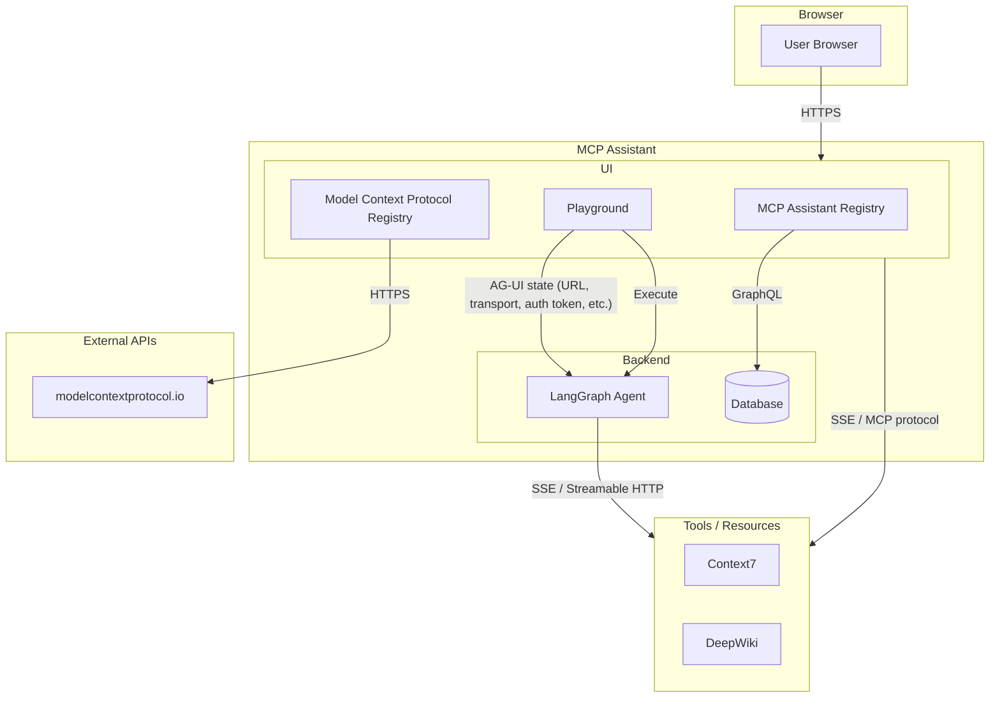

<div align="center">
  
  <h1>MCP Assistant</h1>
  <p><strong>Web-based MCP client for remote servers and AI tool workflows.</strong></p>

  [](https://www.mcp-assistant.in/)
  [](https://zonlabs.github.io/mcp-ts/)
  [](LICENSE)
</div>

## 🌐 Overview

MCP Assistant addresses common pain points when working with the Model Context Protocol:

## ✨ Why MCP Assistant

- Connect to remote MCP servers through `SSE` and `Streamable HTTP`
- Manage multiple MCP servers from a single interface
- Handle OAuth 2.0 and OpenID Connect flows without manual token juggling
- Explore available tools and run them directly from the UI
- Monitor connections in real time while testing and debugging integrations
- Work from anywhere without local MCP server setup

## 🚀 Core Capabilities

### 🔌 Model Context Protocol
- Multi-transport connectivity for modern MCP deployments
- Dynamic server registration and lifecycle management
- Standards-aligned authentication support (`RFC 8414`, OIDC discovery)
- Unified tool discovery and execution workflows

### 🤖 Agent-User Interaction (AG-UI)
- Real-time streaming for responsive conversations
- Structured rendering of tool outputs
- Live execution logs and event updates
- Human-in-the-loop review and approval flows

## 🏗️ Architecture

### Local Gateway for ChatGPT, Claude, and Other MCP Clients


MCP Assistant includes a local gateway that exposes your configured MCP servers through one local endpoint, so desktop/web clients can connect without reconfiguring each remote server.

Run the gateway with:

```bash
uvx mcpassistant-gateway
```

You can then connect that local gateway from ChatGPT, Claude, or any MCP-compatible client.


```mermaid
flowchart TD
    subgraph Browser["Browser"]
        B[User Browser]
    end

    subgraph MCPA["MCP Assistant"]
        subgraph UI["UI"]
            direction TB
            MAR["MCP Assistant Registry"]
            MPR["Model Context Protocol Registry"]
            PG["Playground"]
        end

        subgraph Backend["Backend"]
            LA["LangGraph Agent"]
            DB[("Database")]
        end
    end

    subgraph External["External APIs"]
        MCP_IO["modelcontextprotocol.io"]
    end

    subgraph ToolsResources["Tools / Resources"]
        C7["Context7"]
        DW["DeepWiki"]
    end

    B -- "HTTPS" --> UI
    MAR -- "GraphQL" --> DB
    PG -- "Execute" --> LA
    MPR -- "HTTPS" --> MCP_IO
    PG -- "AG-UI state (URL, transport, auth token, etc.)" --> LA
    UI -- "SSE / MCP protocol" --> ToolsResources
    LA -- "SSE / Streamable HTTP" --> ToolsResources
```

## ⚡ Quick Start

### ➕ Add an MCP Server

1. Open the MCP Servers page.
2. Click `Add Server`.
3. Enter:
   - `Server Name`
   - `Transport Type` (`SSE` or `Streamable HTTP`)
   - `Server URL`
   - Optional OAuth2 configuration
4. Save to connect.

### 💬 Start Using the Assistant

1. Select one or more connected servers from the sidebar.
2. Choose your LLM provider.
3. Enter your API key.
4. Start chatting and execute tools from connected MCP servers.

## 🤝 Contributing

Contributions are welcome.  
Please open an issue for major changes or submit a pull request directly for improvements and fixes.
