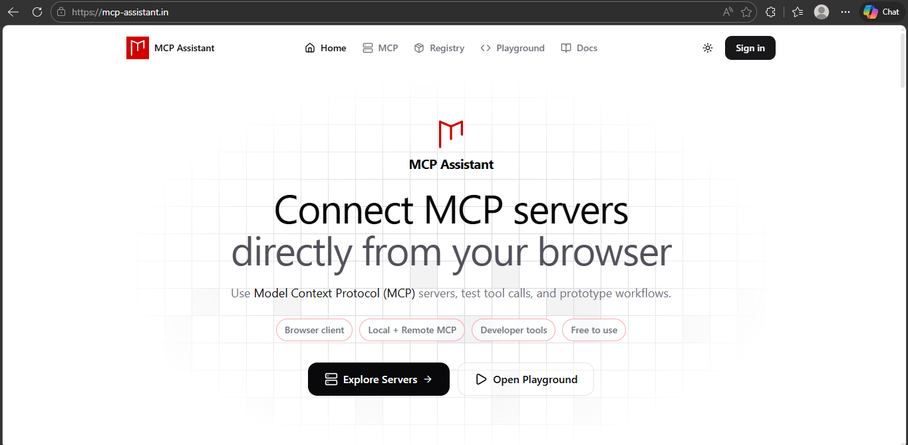
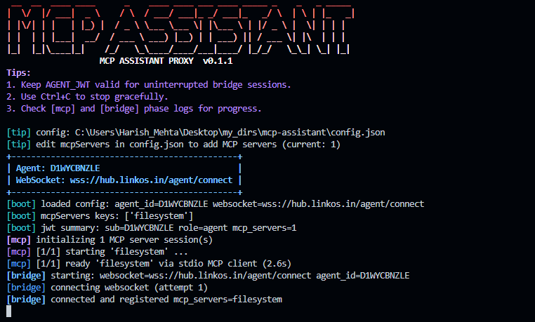
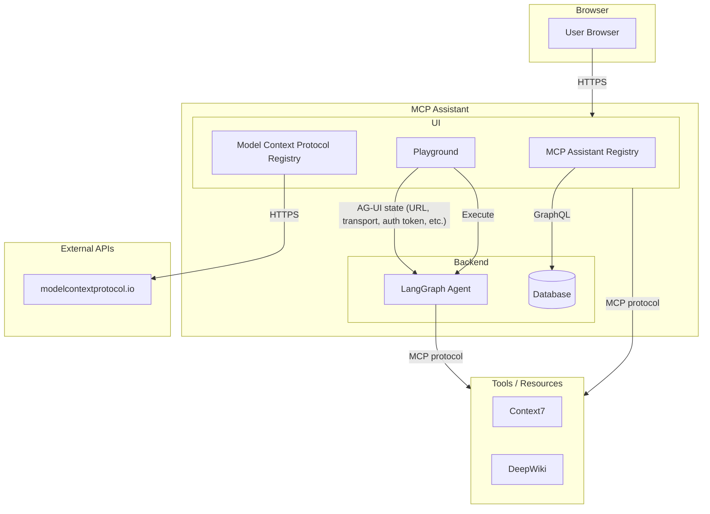

<div align="center">
  
  <h1>MCP Assistant</h1>
  
  <p><strong>Web-based MCP client for remote servers and AI tool workflows.</strong></p>

  [](https://www.mcp-assistant.in/)
  [](https://docs.mcp-assistant.in/)
  [](LICENSE)
</div>

## 🌐 Overview

MCP Assistant addresses common pain points when working with the Model Context Protocol:

## ✨ Why MCP Assistant

- Connect to remote MCP servers from one interface
- Manage multiple MCP servers from a single interface
- Handle OAuth 2.0 and OpenID Connect flows without manual token juggling
- Explore available tools and run them directly from the UI
- Monitor connections in real time while testing and debugging integrations
- Work from anywhere without local MCP server setup

## 🚀 Core Capabilities

- Connect and manage MCP servers from a single workspace
- Discover available tools and execute them from the UI
- Use the local gateway to expose machine-local MCP tools through one endpoint
- Use the same endpoint from any MCP-compatible client (for example: ChatGPT, Claude, and others)
- Enable selected local gateway servers for Playground agent tool execution
- Handle OAuth/OIDC auth flows for protected MCP servers
- Browse registry servers and test integrations before production use

## 🏗️ Architecture

### Local Gateway for ChatGPT, Claude, and Other MCP Clients



MCP Assistant includes a local gateway that exposes your configured MCP servers through one local endpoint, so desktop/web clients can connect without reconfiguring each remote server.

### ⚡ Gateway Quickstart

1. Install and run the gateway:
```bash
uvx mcpassistant-gateway
```
2. Log in from the gateway CLI using `/login`.
3. Start the bridge using `/start`.
4. Open the Gateway page in MCP Assistant and copy your generated MCP URL.
5. Use that URL in your MCP client (for example: ChatGPT, Claude, or the MCP Assistant Playground).


```mermaid
flowchart TD
    subgraph Browser["Browser"]
        B[User Browser]
    end

    subgraph MCPA["MCP Assistant"]
        subgraph UI["UI"]
            direction TB
            MAR["MCP Assistant Registry"]
            MPR["Model Context Protocol Registry"]
            PG["Playground"]
        end

        subgraph Backend["Backend"]
            LA["LangGraph Agent"]
            DB[("Database")]
        end
    end

    subgraph External["External APIs"]
        MCP_IO["modelcontextprotocol.io"]
    end

    subgraph ToolsResources["Tools / Resources"]
        C7["Context7"]
        DW["DeepWiki"]
    end

    B -- "HTTPS" --> UI
    MAR -- "GraphQL" --> DB
    PG -- "Execute" --> LA
    MPR -- "HTTPS" --> MCP_IO
    PG -- "AG-UI state (URL, transport, auth token, etc.)" --> LA
    UI -- "MCP protocol" --> ToolsResources
    LA -- "MCP protocol" --> ToolsResources
```

## ⚡ Quick Start

### ➕ Add an MCP Server

1. Open the MCP Servers page.
2. Click `Add Server`.
3. Enter:
   - `Server Name`
   - `Server URL`
   - Optional OAuth2 configuration
4. Save to connect.

### 🔧 Enable Local MCP Access for Playground

1. Open `Settings` -> `Connectors`.
2. In `Local MCP Access For Playground`, click `Refresh` to detect local gateway servers.
3. Check the servers you want the Playground agent to use.
4. Open Playground and ask for a task that requires those tools.


## 🤝 Contributing

Contributions are welcome.  
Please open an issue for major changes or submit a pull request directly for improvements and fixes.
