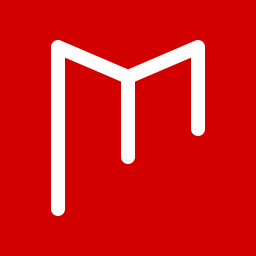
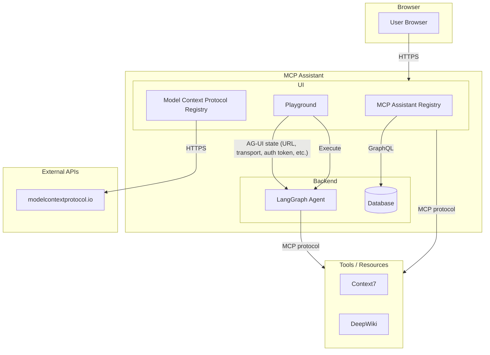

  
  <h1>MCP Assistant</h1>
  
  
<strong>Web-based MCP client for remote servers and AI tools.</strong>

  
  
  

## 🌐 Overview

MCP Assistant addresses common pain points when working with the Model Context Protocol:

## ✨ Why MCP Assistant

- Connect to remote MCP servers from one interface
- Manage multiple MCP servers from a single interface
- Handle OAuth 2.0 and OpenID Connect flows without manual token juggling
- Explore available tools and run them directly from the UI
- Monitor connections in real time while testing and debugging integrations
- Work from anywhere without local MCP server setup

## 🚀 Core Capabilities

- Connect and manage MCP servers from a single workspace
- Discover available tools and execute them from the UI
- Handle OAuth/OIDC auth flows for protected MCP servers
- Browse registry servers and test integrations before production use

## 🏗️ Architecture

## ⚡ Quick Start

### ➕ Add an MCP Server

1. Open the MCP Servers page.
2. Click `Add Server`.
3. Enter:
   - `Server Name`
   - `Server URL`
   - Optional OAuth2 configuration
4. Save to connect.

## 🤝 Contributing

Contributions are welcome.  
Please open an issue for major changes or submit a pull request directly for improvements and fixes.
