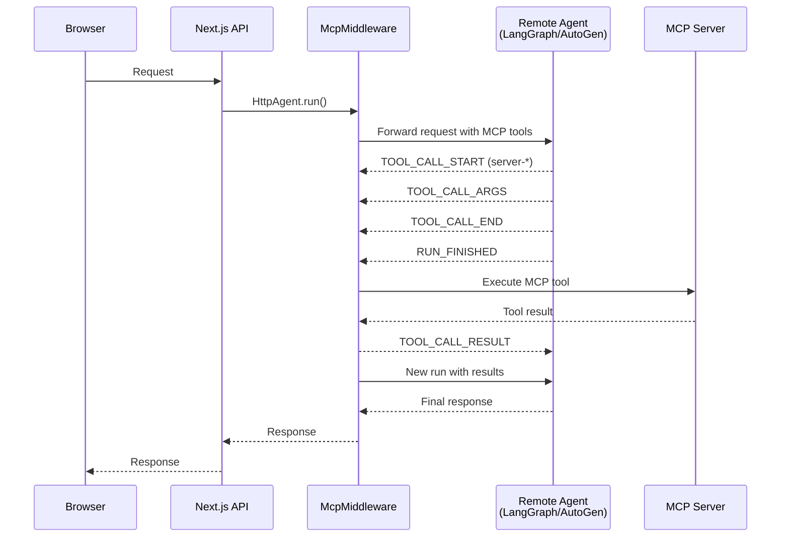

# Adapters

import { IoSparkles } from "react-icons/io5";

Adapters transforms MCP tools into framework-specific formats for seamless integration with AI frameworks.

---

## Available Adapters

| Adapter | Framework | Import Path | Dependencies |
|---------|-----------|-------------|--------------|
| <IoSparkles size={20} color="black" style={{ verticalAlign: 'middle' }} /> **AI SDK** | Vercel AI SDK | `@mcp-ts/sdk/adapters/ai` | `ai` |
|  **LangChain** | LangChain | `@mcp-ts/sdk/adapters/langchain` | `@langchain/core`, `zod` |
|  **Mastra** | Mastra | `@mcp-ts/sdk/adapters/mastra` | `zod` |
|  **AG-UI** | AG-UI Protocol | `@mcp-ts/sdk/adapters/agui-adapter` | `@ag-ui/client`, `rxjs` |

---

<h2><IoSparkles size={24} color="black" style={{ verticalAlign: 'middle', marginRight: '10px', display: 'inline' }} /> AI SDK Adapter</h2>

Convert MCP tools to Vercel AI SDK format.

### Installation

```bash
npm install @mcp-ts/sdk ai
```

### Usage

```typescript
import { MultiSessionClient } from '@mcp-ts/sdk/server';
import { AIAdapter } from '@mcp-ts/sdk/adapters/ai';
import { streamText } from 'ai';
import { openai } from '@ai-sdk/openai';

const client = new MultiSessionClient('user_123');
await client.connect();

const adapter = new AIAdapter(client);
const tools = await adapter.getTools();

const result = await streamText({
  model: openai('gpt-4'),
  tools,
  prompt: 'Search for TypeScript tutorials'
});
```

### API

See [API Reference](./api-reference.md#aiadapter).

---

<h2> LangChain Adapter</h2>

Convert MCP tools to LangChain DynamicStructuredTool format.

### Installation

```bash
npm install @mcp-ts/sdk @langchain/core zod
```

### Usage

```typescript
import { MultiSessionClient } from '@mcp-ts/sdk/server';
import { LangChainAdapter } from '@mcp-ts/sdk/adapters/langchain';

const client = new MultiSessionClient('user_123');
await client.connect();

const adapter = new LangChainAdapter(client);
const tools = await adapter.getTools();

// Use with LangChain agent
const agent = createReactAgent({
  llm,
  tools,
  // ...
});
```

### API

See [API Reference](./api-reference.md#langchainadapter).

---

<h2> Mastra Adapter</h2>

Convert MCP tools to Mastra tool format.

### Installation

```bash
npm install @mcp-ts/sdk zod
```

### Usage

```typescript
import { MultiSessionClient } from '@mcp-ts/sdk/server';
import { MastraAdapter } from '@mcp-ts/sdk/adapters/mastra';

const client = new MultiSessionClient('user_123');
await client.connect();

const adapter = new MastraAdapter(client);
const tools = await adapter.getTools();

// Use with Mastra agent
const agent = new Agent({
  tools,
  // ...
});
```

### API

See [API Reference](./api-reference.md#mastraadapter).

---

<h2> AG-UI Adapter</h2>

Convert MCP tools to AG-UI protocol format for use with remote agents (LangGraph, AutoGen, etc.).

### Installation

```bash
npm install @mcp-ts/sdk @ag-ui/client rxjs
```

### Usage

```typescript
import { MultiSessionClient } from '@mcp-ts/sdk/server';
import { AguiAdapter } from '@mcp-ts/sdk/adapters/agui-adapter';

const client = new MultiSessionClient('user_123');
await client.connect();

const adapter = new AguiAdapter(client);

// Get tools with handlers for server-side execution
const tools = await adapter.getTools();

// Get tool definitions (JSON Schema) for remote agents
const toolDefinitions = await adapter.getToolDefinitions();
```

### API

See [API Reference](./api-reference.md#aguiadapter).

---

## AG-UI Middleware

The AG-UI middleware enables server-side execution of MCP tools when using remote agents. This is essential when your agent runs on a separate backend (e.g., Python LangGraph server) but needs to execute MCP tools that require server-side access.

### How It Works



### Installation

```bash
npm install @mcp-ts/sdk @ag-ui/client rxjs
```

### Usage

```typescript
import { NextRequest } from "next/server";
import { CopilotRuntime, EmptyAdapter, copilotRuntimeNextJSAppRouterEndpoint } from "@copilotkit/runtime";
import { HttpAgent } from "@ag-ui/client";
import { AguiAdapter } from "@mcp-ts/sdk/adapters/agui-adapter";
import { createMcpMiddleware } from "@mcp-ts/sdk/adapters/agui-middleware";

export const POST = async (req: NextRequest) => {
  // Create remote agent connection
  const mcpAssistant = new HttpAgent({
    url: "http://127.0.0.1:8000/agent",
    headers: { "Content-Type": "application/json" },
  });

  // Connect to MCP servers
  const { MultiSessionClient } = await import("@mcp-ts/sdk/server");
  const client = new MultiSessionClient("user_123");
  await client.connect();

  // Create adapter and get tools
  const adapter = new AguiAdapter(client);
  const mcpTools = await adapter.getTools();

  // Add middleware to intercept and execute MCP tools
  mcpAssistant.use(createMcpMiddleware({
    toolPrefix: 'server-',  // Tools starting with this prefix are MCP tools
    tools: mcpTools,
  }));
  
  // Create runtime and handle request
  const runtime = new CopilotRuntime({
    agents: { mcpAssistant },
  });

  const { handleRequest } = copilotRuntimeNextJSAppRouterEndpoint({
    runtime,
    serviceAdapter: new EmptyAdapter(),
    endpoint: "/api/copilotkit",
  });

  return handleRequest(req);
};
```

### Event Flow

The middleware intercepts AG-UI events and executes MCP tools:

| Event | Description |
|-------|-------------|
| `TOOL_CALL_START` | Records tool name and ID, marks MCP tools as pending |
| `TOOL_CALL_ARGS` | Accumulates streamed arguments |
| `TOOL_CALL_END` | Marks tool call as complete |
| `RUN_FINISHED` | Executes pending MCP tools, emits results, triggers new run |
| `TOOL_CALL_RESULT` | Emitted by middleware with MCP tool results |

### Configuration Options

```typescript
createMcpMiddleware({
  toolPrefix: 'server-',  // Prefix to identify MCP tools (default: 'server-')
  tools: mcpTools,        // Pre-loaded tools with handlers
});
```

### API

See [API Reference](./api-reference.md#createmcpmiddleware).

---

## Common Patterns

### Custom Prefix

Avoid tool name collisions:

```typescript
const adapter = new AIAdapter(client, {
  prefix: 'myapp'  // Tools named: myapp_search, myapp_fetch, etc.
});
```

### Single Client

Use with individual MCP client:

```typescript
import { MCPClient } from '@mcp-ts/sdk/server';

const client = new MCPClient({
  identity: 'user_123',
  sessionId: 'session_abc',
  serverUrl: 'https://mcp-server.com',
  callbackUrl: 'https://myapp.com/callback'
});

await client.connect();
const adapter = new AIAdapter(client);
```

### Multi-Session

Aggregate tools from multiple MCP servers:

```typescript
const client = new MultiSessionClient('user_123');

// Connect to multiple servers
await client.connect('server1', 'https://server1.com');
await client.connect('server2', 'https://server2.com');

// Get all tools from all servers
const adapter = new AIAdapter(client);
const tools = await adapter.getTools();
```

---

## Error Handling

All adapters handle disconnected clients gracefully:

```typescript
const adapter = new AIAdapter(client);
const tools = await adapter.getTools();
// Returns empty object/array if client is disconnected
```

LangChain adapter supports simplified errors:

```typescript
const adapter = new LangChainAdapter(client, {
  simplifyErrors: true  // Returns error.message instead of full error object
});
```
