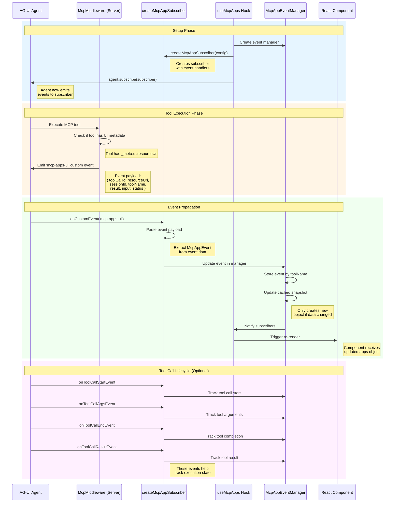

import { SiReact } from "react-icons/si";

<h1> AG-UI Subscriber Pattern</h1>

Framework-agnostic event-driven system for handling MCP app rendering using AG-UI's subscriber pattern. Works with any AG-UI agent without depending on CopilotKit components.

## Overview

The AG-UI subscriber pattern allows you to listen to agent events (tool calls, custom events, state changes) regardless of what UI framework you're using. This makes MCP apps portable across different agent implementations (HttpAgent, LangGraphAgent, custom agents).

## Architecture

```mermaid
flowchart TB
    Agent["AG-UI Agent<br/>(HttpAgent, LangGraphAgent, custom implementation)"]
    Subscriber["createMcpAppSubscriber()<br/>• Listens for 'mcp-apps-ui' custom events<br/>• Tracks tool call lifecycle<br/>• Framework-agnostic event handlers"]
    App["Your Application (React, Vue, Svelte, etc.)<br/>• Render MCP apps based on events<br/>• Display tool call status<br/>• Custom UI logic"]

    Agent -->|agent.subscribe(subscriber)| Subscriber
    Subscriber -->|Event callbacks| App

    style Agent fill:#e3f2fd,stroke:#1976d2,stroke-width:2px
    style Subscriber fill:#f3e5f5,stroke:#7b1fa2,stroke-width:2px
    style App fill:#e8f5e9,stroke:#388e3c,stroke-width:2px
```

## Installation

```bash
npm install @mcp-ts/sdk @ag-ui/client rxjs
```

## How AG-UI Subscriber Fits in the Flow

The AG-UI subscriber pattern is the **event bridge** that connects the agent's tool execution to your React components:



### What Each Component Does

| Component | Role | Purpose |
|-----------|------|---------|
| **createMcpAppSubscriber** | Event listener factory | Creates an AG-UI subscriber that listens for 'mcp-apps-ui' events |
| **useAguiSubscriber** | React hook for custom logic | Attaches subscriber to agent with custom event handlers (side effects only) |
| **useMcpApps** | Main React hook | Combines metadata + events + state management in one hook |
| **McpAppEventManager** | State manager | Stores events, creates cached snapshots, notifies React of changes |

### Key Differences

**createMcpAppSubscriber** (Framework-agnostic):
- Pure JavaScript function
- Works with any AG-UI agent
- No React dependency
- Manual state management required

**useAguiSubscriber** (React hook for side effects):
- React hook that uses `createMcpAppSubscriber` internally
- Handles subscription/cleanup lifecycle
- For custom event handling logic
- You manage state yourself

**useMcpApps** (Complete React solution):
- High-level React hook
- Built-in state management with `useSyncExternalStore`
- Combines tool metadata + events automatically
- Cached snapshots for performance
- Returns ready-to-use `apps` object

## Core Concepts

### McpAppEvent

Events emitted by the middleware when a tool with UI metadata is executed:

```typescript
interface McpAppEvent {
  toolCallId: string;      // Unique ID for this tool call
  resourceUri: string;     // URL of the MCP app to load
  sessionId?: string;      // MCP session ID
  toolName: string;        // Tool name (base name, not prefixed)
  result?: any;           // Tool execution result
  input?: Record<string, unknown>; // Tool input arguments
  status?: 'executing' | 'inProgress' | 'complete';
}
```

### Tool Name Handling

The system transparently handles both base and prefixed tool names:
- **Base names**: `"get-time"` (from MCP server)
- **Prefixed names**: `"tool_abc123_get-time"` (from CopilotKit/AG-UI)
- A JavaScript Proxy automatically handles both formats when looking up apps

## React Hooks

### useMcpApps

Main hook for managing MCP apps. Combines tool metadata (instant, synchronous) with AG-UI events (async, real-time updates).

```typescript
import { useMcpApps } from '@mcp-ts/sdk/client/react';
import { useAgent } from '@copilotkit/react-core/v2';
import { useMcpContext } from './mcp-provider';

function ToolRenderer() {
  const { agent } = useAgent({ agentId: "myAgent" });
  const { mcpClient } = useMcpContext();

  // ✨ One hook to rule them all!
  const { apps, getApp, clear } = useMcpApps(agent, mcpClient);

  return (
    <div>
      {Object.entries(apps).map(([toolName, app]) => (
        <div key={toolName}>
          <McpAppTool app={app} />
        </div>
      ))}
    </div>
  );
}
```

**Features:**
- ✅ Combines tool metadata (instant loading) with events (real-time updates)
- ✅ Transparent tool name handling (works with both base and prefixed names)
- ✅ Uses `useSyncExternalStore` for optimal React 18+ performance
- ✅ Returns `apps` object indexed by tool name
- ✅ Provides `getApp(name)` helper for specific tool lookup
- ✅ Provides `clear()` to reset all apps

**Return Value:**
```typescript
{
  apps: Record<string, McpAppEvent>;  // All MCP apps indexed by tool name
  getApp: (toolName: string) => McpAppEvent | undefined;  // Get specific app
  clear: () => void;  // Clear all apps
}
```

### useAguiSubscriber

For custom event handling without built-in state management:

```typescript
import { useAguiSubscriber } from '@mcp-ts/sdk/client/react';
import { useState } from 'react';
import { HttpAgent } from '@ag-ui/client';

function MyComponent() {
  const [agent] = useState(() => new HttpAgent({ url: '/api/agent' }));
  const [mcpApps, setMcpApps] = useState({});

  useAguiSubscriber(agent, {
    onMcpApp: (event) => {
      setMcpApps(prev => ({
        ...prev,
        [event.toolName]: event
      }));
    },
    onToolCall: (event) => {
      console.log('Tool:', event.toolName, event.status);
    }
  });

  return (
    <div>
      {Object.values(mcpApps).map(app => (
        <McpAppTool key={app.toolName} app={app} />
      ))}
    </div>
  );
}
```

### useToolCallEvents

Track detailed tool call events for debugging or custom UI:

```typescript
import { useToolCallEvents } from '@mcp-ts/sdk/client/react';

function ToolCallDebugger() {
  const [agent] = useState(() => new HttpAgent({ url: '/api/agent' }));
  const { toolCalls } = useToolCallEvents(agent);

  return (
    <div>
      {Object.entries(toolCalls).map(([id, event]) => (
        <div key={id}>
          {event.toolName} - {event.status}
        </div>
      ))}
    </div>
  );
}
```

## Framework-Agnostic Usage

### Basic Subscriber Pattern

```typescript
import { createMcpAppSubscriber } from '@mcp-ts/sdk/client/react';
import { HttpAgent } from '@ag-ui/client';

// Create an AG-UI agent (any type)
const agent = new HttpAgent({
  url: '/api/agent',
});

// Create a subscriber
const subscriber = createMcpAppSubscriber({
  onMcpApp: (event) => {
    console.log('MCP App UI needed:', event);
    renderMcpApp({
      resourceUri: event.resourceUri,
      sessionId: event.sessionId,
      toolInput: event.input,
      toolResult: event.result
    });
  },
  onToolCall: (event) => {
    console.log('Tool call:', event.toolName, event.status);
  }
});

// Attach subscriber to agent
const { unsubscribe } = agent.subscribe(subscriber);

// Later, cleanup
unsubscribe();
```

### Convenience Function

```typescript
import { subscribeMcpAppEvents } from '@mcp-ts/sdk/client/react';

const unsubscribe = subscribeMcpAppEvents(agent, {
  onMcpApp: (event) => {
    // Handle MCP app rendering
  }
});
```

## Simplified McpAppTool Component

The `McpAppTool` component now accepts the `app` object directly:

```typescript
import { McpAppTool } from './McpAppTool';
import { useMcpApps } from '@mcp-ts/sdk/client/react';

function ToolRenderer({ name, args, result, status }) {
  const { agent } = useAgent({ agentId: "myAgent" });
  const { mcpClient } = useMcpContext();
  const { apps } = useMcpApps(agent, mcpClient);

  // Look up app by tool name (works with both base and prefixed names!)
  const app = apps[name];

  return (
    <div>
      {/* Simple: just pass the app object */}
      {app && <McpAppTool app={app} />}

      {/* Or with overrides */}
      {app && (
        <McpAppTool
          app={app}
          toolInput={args}      // Optional override
          toolResult={result}   // Optional override
          toolStatus={status}   // Optional override
        />
      )}
    </div>
  );
}
```

**Old API (verbose):**
```typescript
<McpAppTool
  resourceUri={app.resourceUri}
  sessionId={app.sessionId}
  toolInput={args}
  toolResult={result}
  toolStatus={status}
/>
```

**New API (clean):**
```typescript
<McpAppTool app={app} />
```

## Integration Examples

### With CopilotKit

```typescript
import { useAgent } from "@copilotkit/react-core/v2";
import { useMcpApps } from "@mcp-ts/sdk/client/react";
import { useMcpContext } from "./mcp-provider";

function CopilotKitApp() {
  const { agent } = useAgent({ agentId: "myAgent" });
  const { mcpClient } = useMcpContext();
  const { apps } = useMcpApps(agent, mcpClient);

  return (
    <div>
      {Object.values(apps).map(app => (
        <McpAppTool key={app.toolName} app={app} />
      ))}
    </div>
  );
}
```

### With Custom HttpAgent

```typescript
import { HttpAgent } from '@ag-ui/client';
import { useMcpApps } from '@mcp-ts/sdk/client/react';

function CustomAgentApp() {
  const [agent] = useState(() => new HttpAgent({ url: '/api/agent' }));
  const { apps } = useMcpApps(agent);

  return (
    <div>
      {Object.values(apps).map(app => (
        <McpAppTool key={app.toolName} app={app} />
      ))}
    </div>
  );
}
```

### With LangGraph

```typescript
import { LangGraphAgent } from '@ag-ui/langgraph';
import { createMcpAppSubscriber } from '@mcp-ts/sdk/client/react';

const agent = new LangGraphAgent({
  // LangGraph config
});

agent.subscribe(createMcpAppSubscriber({
  onMcpApp: (event) => {
    // Render MCP app
  }
}));
```

## Advanced Features

### McpAppEventManager

The `McpAppEventManager` class provides built-in state management with cached snapshots:

```typescript
import { McpAppEventManager } from '@mcp-ts/sdk/client/react';

const manager = new McpAppEventManager();

// Attach to agent
manager.attach(agent);

// Get specific event
const event = manager.getEvent('my_tool');

// Get all events (cached reference for useSyncExternalStore)
const allEvents = manager.getAllEvents();

// Subscribe to changes
const unsubscribe = manager.subscribe(() => {
  console.log('Events changed!');
});

// Clear all events
manager.clear();

// Detach from agent
manager.detach();
```

**Why cached snapshots?**
- Prevents infinite render loops in `useSyncExternalStore`
- Only creates new object reference when data actually changes
- Standard React 18+ pattern for external stores

### Transparent Tool Name Handling

The `apps` object uses a JavaScript Proxy to handle both base and prefixed tool names:

```typescript
const { apps } = useMcpApps(agent, mcpClient);

// Both of these work!
const app1 = apps["get-time"];                    // Base name
const app2 = apps["tool_abc123_get-time"];        // Prefixed name

// app1 === app2 (same object!)
```

### Combining Metadata and Events

`useMcpApps` intelligently combines two data sources:

1. **Tool Metadata** (synchronous, instant):
   - From `mcpClient.connections[].tools[]`
   - Available immediately when tools are discovered
   - Provides `resourceUri`, `sessionId`, `toolName`

2. **AG-UI Events** (asynchronous, real-time):
   - From agent's event stream after tool execution
   - Provides `toolCallId`, `result`, `input`, `status`

**The hook merges them:**
```typescript
// Initial state (from metadata):
{
  "get-time": {
    toolCallId: "",
    resourceUri: "http://...",
    sessionId: "abc123",
    toolName: "get-time"
  }
}

// After tool execution (merged with event):
{
  "get-time": {
    toolCallId: "call_xyz",
    resourceUri: "http://...",
    sessionId: "abc123",
    toolName: "get-time",
    result: { ... },
    input: { ... },
    status: "complete"
  }
}
```

## Middleware Setup

Server-side middleware automatically emits `mcp-apps-ui` custom events:

```typescript
// Server-side (Node.js)
import { McpMiddleware } from '@mcp-ts/sdk/adapters/agui-middleware';
import { AguiAdapter } from '@mcp-ts/sdk/adapters/agui-adapter';

const adapter = new AguiAdapter(mcpClient);
const tools = await adapter.getTools();

const middleware = new McpMiddleware({ tools });

// The middleware automatically:
// 1. Executes MCP tools server-side
// 2. Emits 'mcp-apps-ui' custom events when tools have UI metadata
// 3. Includes toolCallId, resourceUri, sessionId, result in event payload
```

## API Reference

### Hooks

| Hook | Description |
|------|-------------|
| `useMcpApps(agent?, mcpClient?)` | Main hook combining metadata + events |
| `useAguiSubscriber(agent, config)` | Side-effect hook for custom logic |
| `useToolCallEvents(agent)` | Tool call lifecycle tracking |

### Functions

| Function | Description |
|----------|-------------|
| `createMcpAppSubscriber(config)` | Creates an AG-UI subscriber |
| `subscribeMcpAppEvents(agent, config)` | Convenience function |

### Classes

| Class | Description |
|-------|-------------|
| `McpAppEventManager` | State management with cached snapshots |

### Types

```typescript
interface McpAppEvent {
  toolCallId: string;
  resourceUri: string;
  sessionId?: string;
  toolName: string;
  result?: any;
  input?: Record<string, unknown>;
  status?: 'executing' | 'inProgress' | 'complete';
}

interface McpAppSubscriberConfig {
  onMcpApp?: (event: McpAppEvent) => void;
  onToolCall?: (event: ToolCallEventData) => void;
  eventName?: string;  // Default: 'mcp-apps-ui'
}

interface ToolCallEventData {
  toolCallId: string;
  toolName: string;
  args?: Record<string, unknown>;
  result?: any;
  status: 'start' | 'args' | 'end' | 'result';
}
```

## Benefits

✅ **Framework-Agnostic** - Works with any AG-UI agent
✅ **No CopilotKit Dependency** - Use with any UI framework
✅ **Type-Safe** - Full TypeScript support
✅ **Flexible** - Multiple integration patterns
✅ **Efficient** - Built-in state management with `useSyncExternalStore`
✅ **Clean Architecture** - Separation of concerns
✅ **Transparent Naming** - Handles both base and prefixed tool names
✅ **Instant Loading** - Combines metadata (instant) with events (real-time)
✅ **Serverless Compatible** - Client-side state management

## Troubleshooting

### Apps not rendering?

1. **Check middleware is emitting events**: Add `console.log` in `onMcpApp` handler
2. **Check tool has UI metadata**: Tool must have `_meta.ui.resourceUri` or `_meta["ui/resourceUri"]`
3. **Check tool name matching**: Use browser devtools to verify tool names in events vs. metadata
4. **Verify agent subscription**: Make sure agent is passed to `useMcpApps`

### Infinite render loops?

- The `McpAppEventManager` uses cached snapshots to prevent this
- Only creates new object references when data actually changes
- This is the standard React 18+ pattern for `useSyncExternalStore`

## Next Steps

- [AG-UI Adapter](./adapters.md#ag-ui-adapter) - Server-side adapter documentation
- [API Reference](./api-reference.md) - Complete API documentation
- [MCP Apps](./mcp-apps.md) - Learn about MCP app rendering
