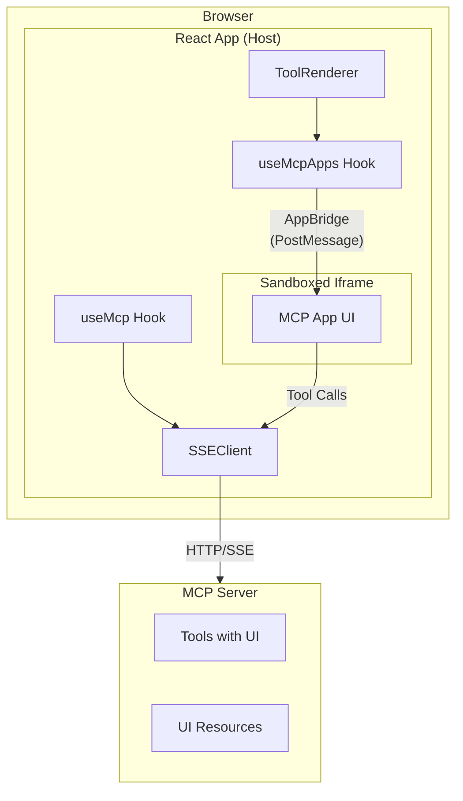
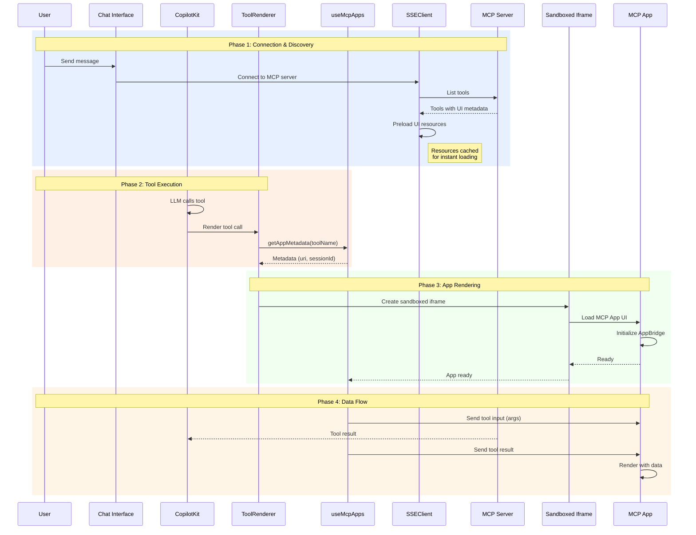

# MCP Apps

MCP Apps enable MCP servers to deliver interactive user interfaces directly in your chat interface. This standardized pattern allows servers to present visual information and gather complex user input beyond text and structured data.

## Overview

When an MCP server exposes a tool with UI metadata (`_meta.ui.resourceUri`), `@mcp-ts/sdk` automatically renders the tool's interface in a sandboxed iframe. The app communicates with the host page through the **AppBridge** protocol, enabling bidirectional communication for tool execution and messaging.



## Key Features

- **Secure Sandboxing** - Apps run in iframes with minimal permissions
- **Resource Preloading** - UI resources are cached at tool discovery for instant loading
- **Bidirectional Communication** - Apps can call server tools and receive results
- **Theme Support** - Host context (theme, platform) passed to apps

## Quick Start

### 1. Setup MCP Connection

First, establish an MCP connection in your app:

```tsx
import { useMcp } from "@mcp-ts/sdk/client/react";

function App() {
  const { mcpClient, connections, connect } = useMcp({
    url: "/api/mcp",
    identity: "user-123",
  });

  // Connect on mount
  useEffect(() => {
    connect("my-mcp-server");
  }, [connect]);

  return (
    <McpProvider mcpClient={mcpClient}>
      <ChatInterface />
    </McpProvider>
  );
}
```

### 2. Render MCP Apps in Tool Calls

Use the simplified `useMcpApps` hook to render MCP apps when tools are called:

```tsx
import { useRenderToolCall } from "@copilotkit/react-core";
import { useMcpApps } from "@mcp-ts/sdk/client/react";

function ToolRenderer() {
  const { mcpClient } = useMcpContext();
  const { getAppMetadata, McpAppRenderer } = useMcpApps(mcpClient);

  useRenderToolCall({
    name: "*",
    render: ({ name, args, result, status }) => {
      // Get metadata for this tool
      const metadata = getAppMetadata(name);
      
      if (!metadata) {
        return null; // Not an MCP app tool
      }

      // Render the MCP app with tool call data
      return (
        <McpAppRenderer
          metadata={metadata}
          input={args}
          result={result}
          status={status}
        />
      );
    },
  });

  return null;
}
```

That's it! The `McpAppRenderer` component handles:
- Iframe creation and sandboxing
- AppBridge protocol communication
- Tool input/result delivery to the app
- Loading states

## How It Works

### Complete Flow



## API Reference

### useMcpApps

```typescript
function useMcpApps(mcpClient: McpClient | null): {
  getAppMetadata: (toolName: string) => McpAppMetadata | undefined;
  McpAppRenderer: React.FC<McpAppRendererProps>;
}
```

**Parameters:**
- `mcpClient` - The MCP client from `useMcp()` or context

**Returns:**
- `getAppMetadata` - Function to look up app metadata by tool name
- `McpAppRenderer` - Stable component for rendering MCP apps

### getAppMetadata

```typescript
function getAppMetadata(toolName: string): McpAppMetadata | undefined
```

Looks up MCP app metadata for a given tool name. Handles tool name prefixes automatically (e.g., `tool_abc123_get-time` → `get-time`).

**Returns:**
- `toolName` - The base tool name
- `resourceUri` - The MCP resource URI for the app UI
- `sessionId` - The session ID for the MCP connection

### McpAppRenderer Props

```typescript
interface McpAppRendererProps {
  metadata: McpAppMetadata;           // Stable metadata from getAppMetadata
  input?: Record<string, unknown>;     // Tool arguments
  result?: unknown;                    // Tool execution result
  status: 'executing' | 'inProgress' | 'complete' | 'idle';
}
```

The `McpAppRenderer` component internally manages:
- Iframe lifecycle
- AppBridge protocol communication
- Tool input/result delivery
- Loading and error states

## Framework Integration

### CopilotKit

Works seamlessly with CopilotKit's `useRenderToolCall`:

```tsx
import { useRenderToolCall } from "@copilotkit/react-core";
import { useMcpApps } from "@mcp-ts/sdk/client/react";

function ToolRenderer() {
  const { mcpClient } = useMcpContext();
  const { getAppMetadata, McpAppRenderer } = useMcpApps(mcpClient);

  useRenderToolCall({
    name: "*",
    render: (props) => {
      const metadata = getAppMetadata(props.name);
      
      if (!metadata) {
        // Not an MCP app tool - render default
        return <DefaultToolCall {...props} />;
      }

      return (
        <McpAppRenderer
          metadata={metadata}
          input={props.args}
          result={props.result}
          status={props.status}
        />
      );
    },
  });

  return null;
}
```

### Custom Frameworks

You can use `useMcpApps` with any framework that provides tool call information:

```tsx
function MyToolRenderer({ toolName, args, result, status }) {
  const { mcpClient } = useMyMcpContext();
  const { getAppMetadata, McpAppRenderer } = useMcpApps(mcpClient);
  
  const metadata = getAppMetadata(toolName);
  
  if (!metadata) return null;
  
  return (
    <McpAppRenderer
      metadata={metadata}
      input={args}
      result={result}
      status={status}
    />
  );
}
```

## Server-Side Setup

MCP servers declare UI apps in tool metadata:

```python
# Python example with FastMCP
from mcp.server.fastmcp import FastMCP

mcp = FastMCP("my-server")

@mcp.tool(
    name="get-time",
    description="Returns the current time",
)
async def get_time() -> str:
    """Returns current time"""
    from datetime import datetime
    return datetime.now().isoformat()

# UI metadata is added via the _meta field
get_time._meta = {
    "ui": {
        "resourceUri": "ui://get-time/mcp-app.html"
    }
}
```

The SDK automatically discovers tools with `_meta.ui.resourceUri` and makes them available via `getAppMetadata()`.

## Troubleshooting

### App not rendering

Check that:
1. The tool has `_meta.ui.resourceUri` set
2. The resource is accessible (preloaded successfully)
3. `getAppMetadata()` returns the metadata (tool name matches)

### Tool input not received

The app receives input when:
1. Iframe is loaded and AppBridge is initialized
2. `input` prop is provided to `McpAppRenderer`
3. App calls `host.onToolInput()` to listen for input

## Next Steps

- See the [React Guide](./react.md) for basic MCP connection setup
- Check the [Examples](https://github.com/zonlabs/mcp-ts/tree/main/examples) on GitHub for complete working implementations
- Review [Adapter Documentation](./adapters.md) for LLM framework integration
