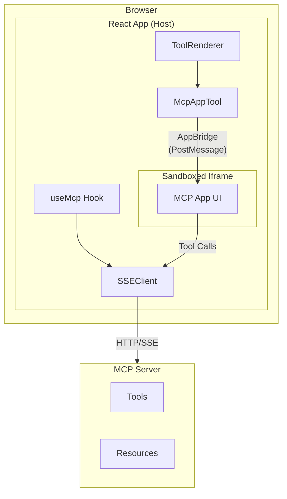
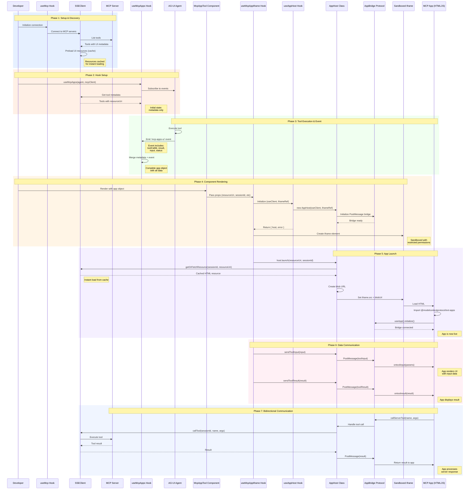
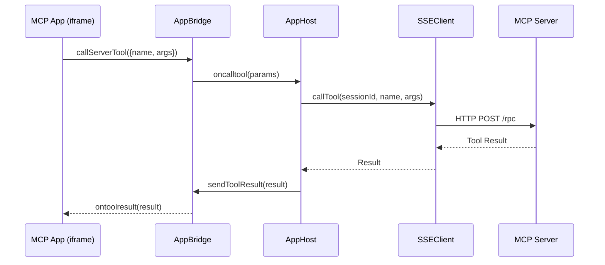
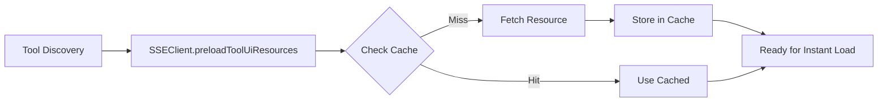

# MCP Apps

MCP Apps enable MCP servers to deliver interactive user interfaces to hosts. This standardized pattern allows servers to present visual information and gather complex user input beyond text and structured data.

## Overview

When an MCP server exposes a tool with UI metadata, `@mcp-ts/sdk` automatically renders the tool's interface in a sandboxed iframe. The app communicates with the host page through the **AppBridge** protocol, enabling bidirectional communication for tool execution and messaging.



## Key Features

- **Secure Sandboxing** - Apps run in iframes with minimal permissions
- **Resource Preloading** - UI resources are cached at tool discovery for instant loading
- **Bidirectional Communication** - Apps can call server tools and receive results
- **Theme Support** - Host context (theme, platform) passed to apps
- **Dynamic Resizing** - Apps can request size changes

## Architecture

### Complete Flow: How MCP Apps Render

This diagram shows the complete lifecycle from hook initialization to app rendering and communication:



### Components

| Component | Description |
|-----------|-------------|
| **AppHost** | Manages iframe lifecycle, sandboxing, and AppBridge connection |
| **SSEClient** | Handles resource preloading and caching for instant UI loading |
| **McpAppTool** | React component that renders the MCP App iframe |
| **useAppHost** | React hook that initializes AppHost for an iframe |

### Communication Flow



## Server-Side Setup

### Registering an MCP App Tool

Tools with UI metadata automatically trigger MCP App rendering:

```typescript
import { McpServer } from "@modelcontextprotocol/sdk/server/mcp.js";

const server = new McpServer({ name: "my-server", version: "1.0.0" });

// Register tool with UI metadata
server.tool(
  "interactive-chart",
  {
    description: "Display an interactive chart",
    inputSchema: {
      type: "object",
      properties: {
        data: { type: "array", items: { type: "number" } }
      }
    },
    // UI metadata - triggers MCP App rendering
    _meta: {
      ui: {
        resourceUri: "ui://interactive-chart/index.html",
        visibility: ["app"]  // Only show in MCP Apps context
      }
    }
  },
  async ({ data }) => {
    return {
      content: [{ type: "text", text: JSON.stringify(data) }]
    };
  }
);
```

### Serving the App HTML Resource

```typescript
// Register the HTML resource
server.resource(
  "ui://interactive-chart/index.html",
  "ui://interactive-chart/index.html",
  { mimeType: "text/html" },
  async () => {
    const html = await fs.readFile("./chart-app.html", "utf-8");
    return {
      contents: [{
        uri: "ui://interactive-chart/index.html",
        mimeType: "text/html",
        text: html
      }]
    };
  }
);
```

## Client-Side Integration

### Using McpAppTool Component

The `McpAppTool` component handles all the complexity of rendering MCP Apps. Use it with the `useMcpApps` hook for automatic MCP app management:

```tsx
import { McpAppTool } from "@/components/mcp/tools/McpAppTool";
import { useMcpApps } from "@mcp-ts/sdk/client/react";
import { useAgent } from "@copilotkit/react-core/v2";
import { useMcpContext } from "./mcp-provider";

function ToolRenderer({ name, args, result, status }) {
  const { agent } = useAgent({ agentId: "myAgent" });
  const { mcpClient } = useMcpContext();

  // useMcpApps tracks all MCP apps and handles tool name matching
  const { apps } = useMcpApps(agent, mcpClient);

  // Look up app by tool name (works with both base and prefixed names)
  const app = apps[name];

  if (!app) {
    return <DefaultToolView name={name} args={args} result={result} />;
  }

  return (
    <McpAppTool
      app={app}
      toolInput={args}
      toolResult={result}
      toolStatus={status}
    />
  );
}
```

### Props

| Prop | Type | Description |
|------|------|-------------|
| `app` | `McpAppEvent` | MCP app event from `useMcpApps` hook |
| `toolInput` | `object` (optional) | Tool input override (defaults to `app.input`) |
| `toolResult` | `unknown` (optional) | Tool result override (defaults to `app.result`) |
| `toolStatus` | `"executing" \| "inProgress" \| "complete"` (optional) | Status override (defaults to `app.status`) |

### Using useAppHost Hook

For custom implementations, use the `useAppHost` hook directly:

```tsx
import { useAppHost } from "@mcp-ts/sdk/client/react";

function CustomMcpApp({ sseClient, resourceUri, sessionId }) {
  const iframeRef = useRef<HTMLIFrameElement>(null);
  const { host, error } = useAppHost(sseClient, iframeRef);

  useEffect(() => {
    if (host) {
      host.launch(resourceUri, sessionId);
    }
  }, [host, resourceUri, sessionId]);

  if (error) return <div>Error: {error.message}</div>;

  return (
    <iframe
      ref={iframeRef}
      sandbox="allow-scripts allow-forms allow-modals allow-popups allow-downloads"
      className="w-full h-96"
    />
  );
}
```

## Building an MCP App

### App HTML Structure

MCP Apps use the `@modelcontextprotocol/ext-apps` package for communication:

```html
<!DOCTYPE html>
<html>
<head>
  <script type="module">
    import { useApp } from "@modelcontextprotocol/ext-apps/app";

    const app = useApp({
      name: "my-chart-app",
      version: "1.0.0"
    });

    // Initialize the app
    await app.initialize();

    // Listen for tool input
    app.ontoolinput = (params) => {
      console.log("Received input:", params.arguments);
      renderChart(params.arguments.data);
    };

    // Listen for tool results
    app.ontoolresult = (result) => {
      console.log("Tool completed:", result);
    };

    // Call server tools
    async function fetchMoreData() {
      const result = await app.callServerTool({
        name: "fetch-data",
        arguments: { limit: 100 }
      });
      updateChart(result);
    }
  </script>
</head>
<body>
  <div id="chart-container"></div>
</body>
</html>
```

### App API Reference

#### Receiving Data

```typescript
// Tool input (arguments passed to the tool)
app.ontoolinput = (params: { arguments: Record<string, unknown> }) => {
  // Handle input
};

// Tool result (after tool execution completes)
app.ontoolresult = (result: unknown) => {
  // Handle result
};

// Tool cancelled
app.ontoolcancelled = (params: { reason: string }) => {
  // Handle cancellation
};
```

#### Calling Server Tools

```typescript
const result = await app.callServerTool({
  name: "tool-name",
  arguments: { key: "value" }
});
```

#### Host Context

```typescript
// Get host context (theme, platform, dimensions)
const context = app.getHostContext();
// { theme: "dark", platform: "web", containerDimensions: { maxHeight: 6000 } }

// Request size change
await app.requestSizeChange({ height: 500 });

// Request display mode
await app.requestDisplayMode("fullscreen"); // or "inline"

// Open external link
await app.openLink({ url: "https://example.com" });

// Send message to host
await app.sendMessage({ role: "assistant", content: "Hello!" });
```

## Resource Preloading

For instant UI loading, resources are preloaded when tools are discovered:



### Cache Hierarchy

1. **SSEClient Cache** (fastest) - Built into the SSE client instance
2. **AppHost Local Cache** - Instance-level cache for direct AppHost usage
3. **Direct Fetch** - Fresh fetch if not cached

```typescript
// Automatic preloading in SSEClient
client.preloadToolUiResources(sessionId, tools);

// Check if resource is cached
if (client.hasPreloadedResource(uri)) {
  // Resource ready for instant load
}

// Get from cache or fetch
const resource = await client.getOrFetchResource(sessionId, uri);
```

## Security

### Iframe Sandbox

MCP Apps run with strict sandbox restrictions:

```html
sandbox="allow-scripts allow-forms allow-same-origin allow-modals allow-popups allow-downloads"
```

| Permission | Purpose |
|------------|---------|
| `allow-scripts` | JavaScript execution |
| `allow-forms` | Form submissions |
| `allow-same-origin` | Blob URL correctness |
| `allow-modals` | Dialogs and alerts |
| `allow-popups` | Opening links in new windows |
| `allow-downloads` | File downloads |

### Restricted Actions

Apps **cannot**:
- Access parent DOM
- Navigate parent window
- Execute scripts outside sandbox
- Access cookies/localStorage (unless same-origin required)
- Make arbitrary network requests to different origins

### PostMessage Isolation

All communication uses structured cloning through PostMessage, preventing direct memory access between host and app.

## Example: Complete Integration

### Server (MCP Server)

```typescript
// server.ts
import { McpServer } from "@modelcontextprotocol/sdk/server/mcp.js";
import fs from "fs/promises";

const server = new McpServer({ name: "demo", version: "1.0.0" });

// Register tool with UI
server.tool(
  "weather-widget",
  {
    description: "Interactive weather display",
    inputSchema: {
      type: "object",
      properties: {
        city: { type: "string" }
      },
      required: ["city"]
    },
    _meta: {
      ui: { resourceUri: "ui://weather-widget/index.html" }
    }
  },
  async ({ city }) => {
    const weather = await fetchWeather(city);
    return { content: [{ type: "text", text: JSON.stringify(weather) }] };
  }
);

// Serve the app HTML
server.resource(
  "ui://weather-widget/index.html",
  "ui://weather-widget/index.html",
  { mimeType: "text/html" },
  async () => ({
    contents: [{
      uri: "ui://weather-widget/index.html",
      mimeType: "text/html",
      text: await fs.readFile("./weather-widget.html", "utf-8")
    }]
  })
);
```

### Client (React)

```tsx
// ToolRenderer.tsx
import { McpAppTool } from "./mcp/tools/McpAppTool";
import { useMcpApps } from "@mcp-ts/sdk/client/react";

export function ToolRenderer({ name, args, result, status, agent, mcpClient }) {
  const { apps } = useMcpApps(agent, mcpClient);
  const app = apps[name];

  return (
    <div className="tool-container">
      <h3>{name}</h3>
      {app && (
        <McpAppTool
          app={app}
          toolInput={args}
          toolResult={result}
          toolStatus={status}
        />
      )}
    </div>
  );
}
```

### MCP App (HTML)

```html
<!-- weather-widget.html -->
<!DOCTYPE html>
<html>
<head>
  <style>
    body { font-family: system-ui; padding: 1rem; }
    .weather-card { background: #f0f0f0; border-radius: 8px; padding: 1rem; }
  </style>
</head>
<body>
  <div id="app" class="weather-card">Loading...</div>

  <script type="module">
    import { useApp } from "@modelcontextprotocol/ext-apps/app";

    const app = useApp({ name: "weather-widget", version: "1.0.0" });
    await app.initialize();

    app.ontoolresult = (result) => {
      const data = JSON.parse(result.content[0].text);
      document.getElementById("app").innerHTML = `
        <h2>${data.city}</h2>
        <p>Temperature: ${data.temp}°C</p>
        <p>Conditions: ${data.conditions}</p>
      `;
    };
  </script>
</body>
</html>
```

## Best Practices

1. **Keep apps lightweight** - Minimize bundle size for fast loading
2. **Handle all states** - Loading, error, and success states
3. **Use preloading** - Let SSEClient cache resources at discovery time
4. **Respect sandbox** - Don't rely on features outside sandbox permissions
5. **Theme awareness** - Use host context for consistent theming
6. **Graceful degradation** - Provide fallback if app fails to load
