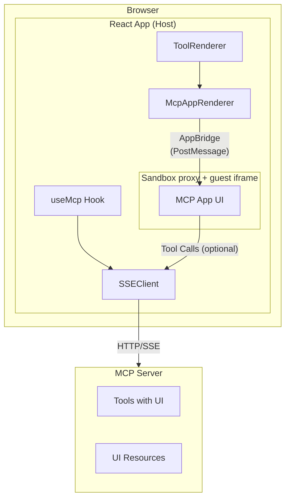

Loading that UI in a **sandboxed iframe**, then syncs tool **input**, **results**, **streaming partial input**, **cancellation**, and **host context** (theme, display mode, etc.) over the **AppBridge** protocol (`@modelcontextprotocol/ext-apps`).

## Overview

When a tool advertises a UI resource URI, `@mcp-ts/sdk` can render it with `McpAppRenderer`. The older `useMcpApps` helper still exists, but `McpAppRenderer` and `getMcpAppMetadata()` are the preferred primitives for new code. For `ui://` and `mcp-app://` resources (and any path where HTML is injected), you must provide a **`sandbox`** configuration pointing at a **sandbox proxy page** you serve from your app (see [Sandbox proxy](#sandbox-proxy)). Tool calls from the guest can be forwarded to your `SSEClient` automatically, or intercepted with **`onCallTool`** / **`onReadResource`** and related callbacks.



## Key features

- **Sandbox proxy** — Injected HTML loads through a dedicated proxy page; CSP can be passed via query string and applied inside the guest document.
- **Resource preloading** — `useMcp` preloads UI resources when tools are discovered (`SSEClient.preloadToolUiResources`), so apps open faster.
- **Host ↔ guest sync** — Tool input, final result, `toolInputPartial`, `toolCancelled`, merged `hostContext` (including `displayMode` for inline/fullscreen).
- **Mediation hooks** — Optional `onCallTool`, `onReadResource`, `onFallbackRequest`, `onMessage`, `onOpenLink`, etc., instead of automatic forwarding.
- **Fullscreen** — Guest `requestDisplayMode` can drive the browser Fullscreen API (handled inside `McpAppRenderer`).

## Sandbox proxy

Hosts must ship a static **MCP Apps sandbox proxy** page (for example copy [`examples/agents/public/sandbox.html`](https://github.com/zonlabs/mcp-ts/tree/main/examples/agents/public/sandbox.html)) that follows **`@modelcontextprotocol/ext-apps`**:

- After load, posts a JSON-RPC notification to the parent with method **`ui/notifications/sandbox-proxy-ready`** (same string as **`SANDBOX_PROXY_READY_METHOD`** from `@modelcontextprotocol/ext-apps`, also re-exported from `@mcp-ts/sdk/client`).
- Listens for **`ui/notifications/sandbox-resource-ready`** from the parent (the host sends this via `AppBridge.sendSandboxResourceReady` after the bridge connects), then writes `params.html` into an inner iframe. Optional CSP: `?csp=` query JSON and/or structured `params.csp` when it is a directive map (`script-src`, etc.).

Point `sandbox.url` at that page (no special query string required; `csp` is appended automatically from `sandbox.csp` when you pass it in React):

```tsx
import { DEFAULT_MCP_APP_CSP } from "@mcp-ts/sdk/client/react";

<McpAppRenderer
   sandbox={{
     url: "/sandbox.html",
     csp: DEFAULT_MCP_APP_CSP,
   }}
/>
```

You can extend `DEFAULT_MCP_APP_CSP` (for example narrow or widen `connect-src`) per deployment.

## Quick start

### 1. MCP connection

Same as the rest of the React client: `useMcp`, connect to your server, expose `mcpClient`. See the [React guide](/react).

### 2. Render MCP Apps on tool calls

Pass **`sandbox`** on every `McpAppRenderer` that loads server UI resources (HTML injection path):

```tsx
import { useRenderToolCall } from "@copilotkit/react-core";
import { McpAppRenderer, DEFAULT_MCP_APP_CSP } from "@mcp-ts/sdk/client/react";
import { useMcpContext } from "./mcp-context";

function ToolRenderer() {
  const { mcpClient } = useMcpContext();

  useRenderToolCall({
    name: "*",
    render: ({ name, args, result, status }) => (
      <McpAppRenderer
        client={mcpClient}
        name={name}
        input={args}
        result={result}
        status={status === "complete" || status === "inProgress" || status === "executing" ? status : "executing"}
        sandbox={{
          url: "/sandbox.html",
          csp: DEFAULT_MCP_APP_CSP,
        }}
      />
    ),
  });

  return null;
}
```

`McpAppRenderer` resolves the UI URI from the tool name using `mcpClient.connections` (see [Tool metadata](#tool-metadata)). You can override the URI or pass raw HTML with `toolResourceUri` / `html`.

### 3. Optional: streaming and cancellation

If your agent streams tool arguments or can cancel a run, pass through:

```tsx
<McpAppRenderer
  name={name}
  input={args}
  result={result}
  status={status}
  sandbox={{ url: "/sandbox.html", csp: DEFAULT_MCP_APP_CSP }}
  toolInputPartial={streamingArgsPartial}
  toolCancelled={wasCancelled}
/>
```

### 4. Optional: host context and mediation

```tsx
<McpAppRenderer
  name={name}
  input={args}
  result={result}
  status={status}
  sandbox={{ url: "/sandbox.html", csp: DEFAULT_MCP_APP_CSP }}
  hostContext={{ theme: "light", locale: "en-US" }}
  onCallTool={async ({ name, arguments: args }) => {
    // Custom path: validate, then call your backend, etc.
    return { /* CallToolResult-shaped */ };
  }}
/>
```

If `onCallTool` / `onReadResource` are omitted, the host forwards to `mcpClient.sseClient` using the session inferred from the tool metadata.

## Tool metadata & Proxy Unwrapping

`getMcpAppMetadata` and `McpAppRenderer` look up UI resources using the first match on the tool name. 
Crucially, they both natively support unwrapping **ToolRouter proxies** (e.g., `mcp_execute_tool`). If a proxy wrapper is encountered, it seamlessly inspects the `input` arguments, resolves the true underlying tool name, strips any prefixes like `tool_github_...`, and returns the underlying UI.

A resource URI may come from:

- `tool.mcpApp.resourceUri`
- `tool._meta?.ui?.resourceUri`
- `tool._meta?.['ui/resourceUri']`

## Preloading

When the client receives tool discovery events, `useMcp` calls `SSEClient.preloadToolUiResources(sessionId, tools)` so `ui://` / `mcp-app://` HTML is often already cached before the user opens a tool.

For advanced use, `AppHost` also exposes `preload(tools)` (see [API reference](/reference/client#apphost-class)).

## API summary

### `getMcpAppMetadata(mcpClient, toolName, input?)`

```typescript
function getMcpAppMetadata(
  mcpClient: McpClient | null,
  toolName: string,
  input?: Record<string, unknown> | null
): McpAppMetadata | undefined;
```

Returns `{ toolName, resourceUri, sessionId }` when the tool has a UI URI. Use for conditionally checking if an Interactive UI exists for a tool before rendering. If `toolName` is a proxy like `mcp_execute_tool`, supplying `input` will allow it to unwrap the proxy and find the target app accurately.

### `McpAppRendererProps`

| Prop | Type | Description |
|------|------|-------------|
| `client` | `McpClient?` | Your active MCP client object. |
| `name` | `string` | Tool name (matched against connection tools). Passes natively through proxy unwrapper. |
| `input` | `Record<string, unknown>?` | Tool arguments; sent with `sendToolInput` after launch. |
| `result` | `unknown?` | Final tool result; sent when `status === 'complete'`. |
| `status` | `'executing' \| 'inProgress' \| 'complete' \| 'idle'` | Optional; default `'idle'`. |
| `toolResourceUri` | `string?` | Override UI resource URI from metadata. |
| `html` | `string?` | Raw HTML instead of fetching `toolResourceUri`. |
| `sandbox` | `SandboxConfig?` | **Required** for injected HTML: `{ url, csp?, permissions? }`. |
| `hostContext` | `Record<string, unknown>?` | Merged with defaults; `displayMode` is set by the renderer. |
| `toolInputPartial` | `any?` | Streamed partial input (`sendToolInputPartial`). |
| `toolCancelled` | `boolean?` | When truthy, sends tool cancelled to the guest. |
| `onCallTool` | `(params) => Promise<unknown>?` | Override automatic `callTool` forwarding. |
| `onReadResource` | `(uri: string) => Promise<{ contents: … }>?` | Override resource reads. |
| `onFallbackRequest` | `(request: any) => Promise<any>?` | AppBridge fallback JSON-RPC. |
| `onLoggingMessage` | `(params) => void?` | Guest logging notifications. |
| `onSizeChanged` | `(params) => void?` | Guest size changes (iframe height adjusted automatically). |
| `onError` | `(error: Error) => void?` | Bridge / launch errors. |
| `className` | `string?` | Container class names. |
| `loader` | `React.ReactNode?` | Shown until the app finishes launching. |

## Next steps

- [React guide](/react) — Connection setup and `useMcp`.
- [API reference](/reference/client) — Detailed technical documentation.
- [MCP App host comparison](/mcp-app-host-comparison) — `mcp-ts` vs `@mcp-ui/client`.
