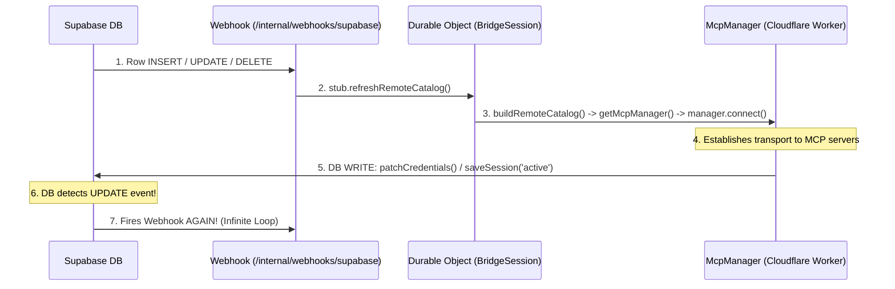

# Incident Postmortem & Troubleshooting: Worker Timeout Quota & Webhook Recursion Loop

## 1. Incident Overview

During local development and client usage (`mcp-client`), the Cloudflare Worker runtime crashed repeatedly with the following error:

```text
(error) [McpManager] Failed to connect to session sess_... after 3 attempts:
QuotaExceededError: You have exceeded the number of active timeouts you may set. 
max active timeouts: 10000, current active timeouts: 10000, finished timeouts: 20671
```

This was accompanied by:
- A rapid reconnection storm (`DISCONNECTED → INITIALIZING → CONNECTING → FAILED` cycling multiple times per second).
- Severe Supabase database latency spikes (reads and writes such as `getCredentials` and `patchCredentials` surging from ~50ms to **20,000ms+**).
- Rapid spam of `BridgeSession.refreshRemoteCatalog` execution logs.

---

## 2. Root Cause Analysis

The incident was caused by two compounding mechanisms:

### A. The Primary Trigger: Webhook Recursion Feedback Loop

A database webhook was configured in Supabase on `mcp_sessions` / `mcp_credentials` to notify the Cloudflare Worker (`POST /internal/webhooks/supabase`) whenever a row was modified.



1. Any routine connection write (e.g. `saveSession('active')` or `patchCredentials`) emitted an `UPDATE` event.
2. Supabase sent an HTTP webhook to `/internal/webhooks/supabase`.
3. The webhook handler invoked `stub.refreshRemoteCatalog()` on the `BridgeSession` Durable Object.
4. `refreshRemoteCatalog()` called `buildRemoteCatalog(userId)` $\rightarrow$ created a new `McpManager(userId)` $\rightarrow$ called `manager.connect()`.
5. `manager.connect()` connected to all user sessions and updated session metadata in the database (`patchCredentials`), emitting **another `UPDATE` event**.
6. This created an exponential amplification loop ($1 \rightarrow 4 \rightarrow 16 \rightarrow 64 \dots$), generating hundreds of concurrent requests per second.

---

### B. The Failure Mechanism: Cloudflare's 10,000 Active Timeouts Limit

- **Cloudflare Runtime Constraint**: Cloudflare Workers (`workerd`) enforces a hard limit of **10,000 active concurrent `setTimeout` / timer handles** per worker isolate.
- **Unclosed Failed Transports**: When `McpClient.connect()` or `McpManager.establishConnectionWithRetries()` timed out or failed, `client.close()` / `client.disconnect()` was not called on error.
- Background SSE streams, AbortController timeouts, and keepalive timers accumulated in memory until the 10,000 ceiling was hit.
- Once 10,000 active timers were registered, **any new `setTimeout` or `fetch()` call instantly threw `QuotaExceededError`**, which immediately triggered another failure and reconnect cycle.

---

## 3. Immediate Remediation

1. **Worker Maintenance Mode**:
   Set `OFFLINE_MODE = true` in [`mcp-ts/mcp/src/index.ts`](file:///c:/Users/Harish_Mehta/Desktop/my_dirs/workspace/mcp-ts/mcp/src/index.ts) and deployed via `wrangler deploy` to immediately return `503 Service Unavailable` with CORS headers. This stopped incoming traffic and allowed active worker isolates and DB pools to drain.

2. **Removed Unrestricted `UPDATE` Webhook Event**:
   In the Supabase Dashboard, updated the database webhook to only listen to `INSERT` and `DELETE`, stopping the automatic recursion caused by routine metadata saves.

---

## 4. Architecture Safeguards & Things to Keep in Mind

### 1. Webhook Design (Selective Filtering)

#### Why removing `UPDATE` has a side effect:
If `UPDATE` is completely disabled on the webhook:
- `INSERT` (new server added) and `DELETE` (server removed) will invalidate the live catalog.
- If a user changes server configuration (e.g. toggles `enabled: false`, modifies `server_url`, or edits `tool_policy`), the live Durable Object will not auto-refresh until a reconnect occurs.

#### Safe way to re-enable `UPDATE` (Column-level filtering):
If you need live config updates, add a PostgreSQL filter condition to the Supabase webhook trigger so it only fires when configuration columns change (and ignores token/timestamp writes):

```sql
-- Trigger only when server config changes, NOT on routine touch/token updates:
OLD.enabled IS DISTINCT FROM NEW.enabled 
OR OLD.server_url IS DISTINCT FROM NEW.server_url 
OR OLD.headers IS DISTINCT FROM NEW.headers 
OR OLD.tool_policy IS DISTINCT FROM NEW.tool_policy
```

---

### 2. In-Worker Webhook Filtering on `mcp_sessions`

In the `@mcp-ts/client` Supabase schema, all session and OAuth data (including `tokens`, `code_verifier`, `oauth_state`, and `discovery_state`) is stored in a single table: **`public.mcp_sessions`**.

In [`mcp-ts/mcp/src/routes/webhooks.ts`](file:///c:/Users/Harish_Mehta/Desktop/my_dirs/workspace/mcp-ts/mcp/src/routes/webhooks.ts), we ignore any `UPDATE` where only routine tokens/timestamps changed:

```typescript
// Only handle events for mcp_sessions
if (payload.table && payload.table !== "mcp_sessions") {
  return c.json({ ok: true, message: `Ignored non-session table: ${payload.table}` });
}

// For UPDATE events, only refresh if user configuration actually changed
if (payload.type === "UPDATE" && payload.old_record && payload.record) {
  const oldRec = payload.old_record;
  const newRec = payload.record;
  const isConfigUnchanged =
    oldRec.server_url === newRec.server_url &&
    oldRec.enabled === newRec.enabled &&
    oldRec.server_name === newRec.server_name &&
    oldRec.server_id === newRec.server_id &&
    JSON.stringify(oldRec.headers ?? null) === JSON.stringify(newRec.headers ?? null) &&
    JSON.stringify(oldRec.tool_policy ?? null) === JSON.stringify(newRec.tool_policy ?? null) &&
    JSON.stringify(oldRec.server_options ?? null) === JSON.stringify(newRec.server_options ?? null);

  if (isConfigUnchanged) {
    return c.json({ ok: true, message: "Ignored routine token/timestamp update on mcp_sessions" });
  }
}
```

---

### 3. Debounce & Mutex Guard in Durable Object

In [`mcp-ts/mcp/src/durable-objects/bridge-session.ts`](file:///c:/Users/Harish_Mehta/Desktop/my_dirs/workspace/mcp-ts/mcp/src/durable-objects/bridge-session.ts), guard `refreshRemoteCatalog()` against burst events (e.g. bulk server imports):

```typescript
export class BridgeSession extends DurableObject<BridgeSessionEnv> {
  private isRefreshing = false;
  private lastRefreshTime = 0;

  async refreshRemoteCatalog(): Promise<void> {
    const now = Date.now();
    // 1. Mutex: If a refresh is already running, skip
    // 2. Cooldown: If a refresh completed < 2000ms ago, skip
    if (this.isRefreshing || (now - this.lastRefreshTime < 2000)) {
      return;
    }

    this.isRefreshing = true;
    try {
      const socket = activeSocket(this.ctx);
      const attachment = socket?.deserializeAttachment() as BridgeAttachment | null;
      if (!attachment?.initialized) return;

      const catalog = await runWithRequestContext(
        { userId: attachment.userId, env: this.env as any },
        async () => await buildRemoteCatalog(attachment.userId),
      );
      this.lastRefreshTime = Date.now();
      await this.publishRemoteCatalog(catalog);
    } finally {
      this.isRefreshing = false;
    }
  }
}
```

---

### 4. Client Transport Cleanup on Connection Failure

In [`packages/client/src/server/mcp/client.ts`](file:///c:/Users/Harish_Mehta/Desktop/my_dirs/workspace/mcp-ts/packages/client/src/server/mcp/client.ts) and [`packages/client/src/server/mcp/manager.ts`](file:///c:/Users/Harish_Mehta/Desktop/my_dirs/workspace/mcp-ts/packages/client/src/server/mcp/manager.ts), always close transports when `connect()` throws:

```typescript
// In client.ts catch block:
} catch (error) {
  if (this.client.transport) {
    this.transport = null;
    try { await this.client.close(); } catch {}
  }
  ...
}

// In manager.ts catch block:
} catch (error) {
  lastError = error;
  try { await client.disconnect(); } catch {}
  if (attempt < maxRetries) {
    const delay = retryDelay * Math.pow(2, attempt);
    await new Promise(resolve => setTimeout(resolve, delay));
  }
}
```

---

## 5. Summary Checklist

| Component | Risk | Safeguard |
| :--- | :--- | :--- |
| **Supabase Webhooks** | Recursive write triggers | Filter out `mcp_credentials`; only fire on config column changes (`enabled`, `server_url`, `tool_policy`). |
| **Durable Object (`BridgeSession`)** | Webhook burst floods | Add Mutex + 2-second debounce to `refreshRemoteCatalog`. |
| **MCP Client (`McpClient`)** | Leaked timeouts/streams | Always call `client.close()` / `disconnect()` on failed connections. |
| **McpManager** | Rapid tight reconnect loop | Use exponential backoff (`Math.pow(2, attempt) * retryDelay`) and teardown failed instances. |
| **Cloudflare Worker** | Emergency circuit breaker | Use `OFFLINE_MODE` flag in `index.ts` to instantly return 503 during incidents. |
